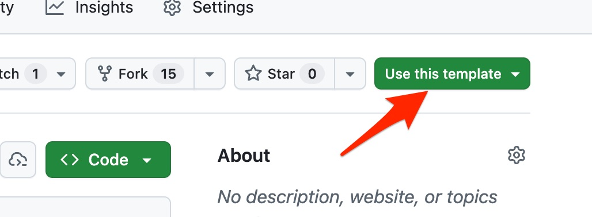

# Portfolio Instructions

This template is the start of your professional portfolio. It is also part of your journey at MAE and will be reviewed, as needed, by your instructor and the Undergraduate Program Office.

You only need to set it up once, and then your work is a loop: **Edit** your files &rarr; **Preview** the portfolio site on your own screen &rarr; **Publish** it to the web by pushing to GitHub.

Before we start, two notes:

> ⚠️ This README was copied into your repository and does not update when the template does. If something here does not match what you see, check the [original template README](https://github.com/Cornell-MAE-UG/portfolio/blob/main/README.md).

> ⚠️ You might be tempted to edit your files on GitHub directly, but that skips the testing step, and in a real work setting you would never edit code directly on a server.

---

## Set Up Your Portfolio (do this once)

### Create Your Own Repository from the Template

1. Go to the [template repository](https://github.com/Cornell-MAE-UG/portfolio) on GitHub
    > ⚠️ You probably want to open this link in a new window to keep reading this document.
2. Click the green **Use this template** button, then **Create a new repository**.


3. Under "Owner", choose your own GitHub account.
4. Give the repository a name. Something like `portfolio` is a good choice, since the name becomes part of your published web address.
5. Leave the repository set to **Public**. On a free GitHub account, only public repositories can be published as a website, so a private one can never go live.
6. Click **Create repository**.

You now have your own repository — a full, independent copy of the template. Nothing you do to it affects the template, and nothing done to the template changes yours. Everything from here on happens in *your* repository.

### Turn On GitHub Pages

This is what puts your portfolio on the web. Do it now, before you change anything: the template is already a working site, so you will have something live to look at from the start. It happens in your repository's settings, not your account settings.

1. Open your repository's **Settings** tab.


2. Choose **Pages** in the left sidebar. Under "Build and deployment", check that "Source" says **Deploy from a branch**, then set "Branch" to `main` and the folder to `/ (root)`.


3. Click **Save**.

After 1–2 minutes your site is live. **Its address is shown at the top of that same Pages settings page**. Open it: what you see is the template, and the rest of these instructions are how you make it your own.

### Open a Working Copy

Your working copy will live in a [Codespace](https://github.com/features/codespaces): an online development environment where you can edit, test, commit, and push. Create one from the green "Code" button on your repository.


> 🚨 Working in a Codespace is not the same as editing directly on GitHub. The Codespace is your private test computer. This means your changes still have to be committed and pushed to GitHub before they appear online. The same goes for the preview server in Step 2: it is temporary and visible only to you, and nothing is published until you push.

#### For Advanced Users

You can, of course, clone the repository to your laptop and work in an editor like [Visual Studio Code](https://code.visualstudio.com/), or in a terminal with the git command line. You may have to sort out some Ruby setup that a Codespace handles for you, but you can work offline and previews are faster.

---

## Step 1: Editing the Files to Personalize Your Portfolio

> The `< >` and `[ ]` brackets mark placeholders. Delete them along with the text inside; do not keep them around your own text.

### Name

Change `title` and `name` in `_config.yml` to your actual name. Your name is taken from there everywhere it appears: the heading on your home page, the menu bar, and the browser tab.

### Homepage
- In `_config.yml`, replace `description` with one line about yourself. It appears under your name at the top of your home page.
- In `index.md`, replace the placeholder text with a short introduction to yourself.
- Replace `assets/images/profile-pic.jpg` with a portrait of yourself.

### Projects
- In the `_projects` folder, make one page per project, using the example pages (such as `2022-trig-analysis.md`) as your starting point. They also show how to include code and images in a page.
- Each project has a main image, set by the `image` variable in the front matter: the block at the top of the page between the `---` lines. Any shape of picture works — it is cropped to match the others.
- Right next to it, set `imagealt` to a short description of what the image shows, for example `imagealt: Shaded CAD rendering of a 1940s tabletop radio`. A screen reader reads this aloud, and search engines read it, in place of the picture itself.
- The filename sets the order of projects in your gallery, so start it with the date, as the examples do.
- Your home page shows your three most recent projects. To pick one yourself, add `featured: true` to its front matter: featured projects come first, and the newest of the rest fill the places left over.
- Portfolio images live in `assets/images`; delete the ones you don't need. (This README's screenshots live separately, in `assets/readme`.)
- Delete the example project pages once you have your own.
- Photograph your work against a plain background, in landscape, one thing per picture. Consistent images are most of what makes a portfolio look finished.
- For other formatting, see the [Jekyll Markdown documentation](https://jekyllrb.com/docs/markdown/).

### CV
- Replace `assets/CV.pdf` with your own CV as a PDF.
- The placeholder text in `_pages/cv.md` is yours to edit or delete.

> ⚠️ Your CV becomes a public file on the web, so take out your home address and phone number before you commit it. Replacing the file later does not undo this: every version you have ever committed stays in your repository's history, where anyone can still read it.

### Colors and Styling

Set `color_scheme` in `_config.yml` to one of the schemes listed in the comment next to it:

```yaml
color_scheme: aqua
```

Beyond the schemes, you can change colors, fonts, spacing, and anything else by editing `_sass/custom.scss` — see [Advanced Customization](#advanced-customization) below.

### Commit Your Changes

Commit often as you work — each commit saves your progress. In the terminal, run:

```bash
git add .
git commit -m "<Commit Message>"
```

Replace `<Commit Message>` with a short description of what you changed, for example `Add heat exchanger project`.

> ⚠️ `git add .` stages **every** file in the folder, not only the ones you meant to edit, and anything you commit becomes public and permanent. Keep graded feedback, drafts, and anything else you do not want on the web in the `private/` folder: nothing in there is ever committed or published.

In VS Code or a Codespace, you can stage and commit through the Git panel instead — the small branch icon in the left sidebar ([documentation](https://code.visualstudio.com/docs/editor/versioncontrol)).

---

## Step 2: Running the Site Locally for Testing

At any point you can see your portfolio as a website by running a local web server. This happens **in the terminal** — the one at the bottom of your Codespace, or your own terminal on your laptop. If the Codespace terminal is closed, open one from the menu at the top left (three horizontal lines): `Terminal -> New Terminal`.

Once, to install the packages Jekyll needs:
```bash
bundle install
```

Then, to start the server:
```bash
bundle exec jekyll serve
```

Leave the server running while you work: most edits appear as soon as you save the file and reload the page. Changes to `_config.yml` are the exception — click into the terminal, then hold the Control key and press C to stop the server (that is what "ctrl-c" means; it is typed, not clicked), and run the command again.

The server prints the address of your site:
```text
    Server address: http://127.0.0.1:4000/
  Server running... press ctrl-c to stop.
```

Cmd-click (Mac) or Ctrl-click (Windows) that address **in the terminal** to open it. From a Codespace, copying it into your own browser will never work: `127.0.0.1` means "this computer", and the Codespace is not your computer. On your laptop, `http://localhost:4000/` works too.

---

## Step 3: Publishing Your Portfolio to the Web

Your portfolio does not change on the web until you push your commits to GitHub. What you see on your local test server is not permanent and nobody else can see it.

### Push Your Changes to GitHub

Once everything looks good, commit anything outstanding and push:

```bash
git add .
git commit -m "<Commit Message>"
git push 
```

> Remember that `git add .` stages everything in the folder. Anything private belongs in `private/`.

In VS Code or a Codespace, the Git panel can stage, commit, and push for you.

### Your Published Portfolio Site

A few minutes after each push, your changes are live. Your address is built from your GitHub username and the repository's name, so if you rename the repository or move it to another account, the old address stops working and Settings → Pages shows you the new one. Remember to update your résumé and profiles if you have already put the link there. :tada:

**You can now replace this README with something of your own**, but have a look at the sections below first.

### Taking Your Portfolio Offline

To take your site off the web, go to Settings → Pages and use **Unpublish site**. That removes the public website only: your repository stays exactly as it is, and you can publish again later by setting the branch the same way you did at setup.

---

## If Something Goes Wrong

**My site's address gives a 404, or says "There isn't a GitHub Pages site here".**
Pages was never turned on. Go to your repository's Settings (not your account settings) → Pages, set Source to "Deploy from a branch", Branch to `main` and the folder to `/ (root)`, and save. If there is no branch to choose, or the option is missing, check that your repository is **Public** — on a free account only public repositories can be published.

**I pushed my changes but the website never updated.**
Give it a few minutes and hard-refresh your browser (Cmd-Shift-R or Ctrl-Shift-R). If it is still stale, the build **failed** — GitHub leaves the old version up and says nothing on the site itself. Open your repository's **Actions** tab, look for a red ✗ next to "pages build and deployment", and click it to read the error.

**I edited `_sass/custom.scss` and now the site will not update at all.**
An error in that file stops the whole build, so nothing publishes. Look for a missing `}` or `;`, or a `$variable` spelled differently from where it was defined. To get back to a working site, undo your last change to that file, commit, and push.

**I renamed my repository and now the site looks like plain text with no pictures.**
Your web address changed with the name, and the published site catches up on its next build. Push any commit to trigger one. The current address is always the one shown in Settings → Pages.

**I came back to my Codespace and my changes are gone.**
Codespaces shut down when idle and are deleted after longer inactivity, taking anything you never committed with them. Commit often, and push before you stop working for the week.

**I cannot create a Codespace — it says I have used up my included hours.**
Codespaces are free up to a monthly limit on your personal account, and that limit resets each month. Delete any codespaces you are no longer using from [github.com/codespaces](https://github.com/codespaces), and stop yours when you finish working rather than leaving it running. You can also raise the limit, for free, by activating the [GitHub Student Developer Pack](https://education.github.com/pack) — worth doing regardless. If you are stuck in the meantime, you can work on your own laptop instead: see "For Advanced Users" in the setup section.

**The address the server prints, `http://127.0.0.1:4000/`, will not open.**
`127.0.0.1` means "this computer", and the Codespace is not your computer, so copying that address into your own browser will never work. Click the link *in the Codespace terminal*, or open the "Ports" tab at the bottom and use the entry for port 4000.

---

## Advanced Customization

You can restyle any part of the portfolio by editing `_sass/custom.scss`, which is written in [Sass](https://sass-lang.com/) — a superset of CSS, so ordinary CSS rules work there as they are. For example, change the width of the text by setting the `max-width` of `.container`:

```css
.container {
  max-width: 1000px;
}
```

Underneath, your portfolio is a [Jekyll](https://jekyllrb.com/) site, [documented here](https://docs.github.com/en/pages/setting-up-a-github-pages-site-with-jekyll). That means you can go further and replace the styling with another Jekyll theme, from [Jekyll Themes on GitHub](https://github.com/topics/jekyll-theme), [Start Bootstrap](https://startbootstrap.com/themes/jekyll/), or [Jekyll Themes](https://jekyllthemes.io/). Follow the theme's own instructions, and expect to adapt your content to fit it.

## Tips and Tricks

### Commenting Out Content

To keep a bit of text or an image in a page without showing it, wrap it in a `` block:

```liquid

    Stuff you want to comment out.

```

> This hides the text from the published page only. It is still in the file, in your public repository, and in that repository's history. An HTML comment (`<!-- ... -->`) hides even less: it is sent to the browser, and anyone can read it with View Source.
