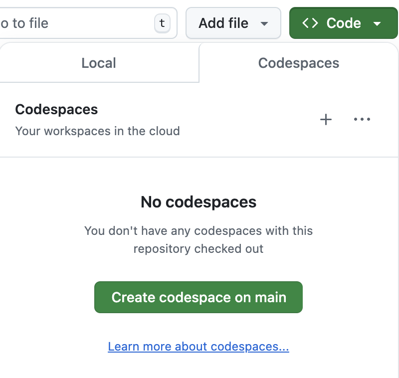
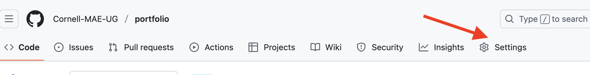
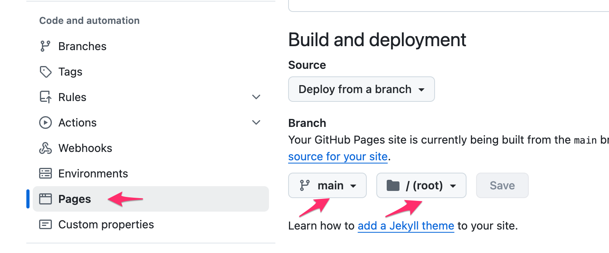

> ⚠️ Due to occasional updates, this README file might be out of date with the latest instructions. Please refer to the [Original Repository README file](https://github.com/Cornell-MAE-UG/portfolio/blob/main/README.md) for up-to-date instructions.

# Portfolio Instructions

This is a template for you to start building your professional portfolio. It is also part of your journey at MAE and will be reviewed, as needed, by your instructor and the Undergraduate Program Office.

This README lives in the portfolio template and travels into your own copy of it. Step 1 below shows you how to make that copy. Once you are up and running, you can delete this README file or replace it with your own content if you wish.

In the following sections, you will find instructions on how to edit, test, and publish your portfolio.

## Portfolio Editing Workflow

It's important to understand the logic of the workflow to edit and publish your portfolio. The process goes as follows:

1. Once: **Create your own copy of the portfolio repository**, then open a working copy of it that you can edit.
Your portfolio is stored on GitHub. You _could_ edit it directly on there, but this is inconvenient, inefficient, and error-prone. 
> In a realistic work setting, you would never edit code directly on a server.
2. On you working copy, you **edit any relevant files**, add images, new project pages, text, etc. 
Remember to [commit](https://docs.github.com/en/get-started/using-git/about-git#basic-git-commands) often to save your progress. 
3. Once you made changes, **test out your portfolio by running a local test webserver** and see if it looks as planned.
4. If you're happy, make sure everything is committed and **push your changes to Github**. Then publish your portfolio through GitHub Pages.
> Once your portfolio is live on the internet, every time you push new changes, GitHub will publish your updated portfolio to the Internet. This usually takes a few minutes before it is live. Make sure you understand which edits are local to your working copy and which are pushed (sent to) the central repository on GitHub and thus public. Also, make sure you understand when you are looking at the portfolio on your local test server and when you are viewing the live version on GitHub Pages.
5. Rinse and repeat from Step 2 above. 

We will go through each of these steps in the following sections. 

---

## Step 1: Creating Your Portfolio Repository and a Working Copy

### Create Your Own Repository from the Template

Your portfolio starts as your own copy of this template repository, stored in your personal GitHub account.

1. Go to the [template repository](https://github.com/Cornell-MAE-UG/portfolio) on GitHub.
2. Click the green **Use this template** button, then **Create a new repository**.
3. Under "Owner", choose your own GitHub account.
4. Give the repository a name. Something like `portfolio` is a good choice, since this name becomes part of your published web address.
5. Click **Create repository**.

You now have your own repository. It is a full, independent copy: nothing you do to it affects the template, and nothing done to the template changes yours. Everything from here on happens in *your* repository, not in the template.

### Open a Working Copy

You will set up your local copy on an online [Codespaces](https://github.com/features/codespaces) environment for development. You create a Codespace through the "Code" button as shown in the image below. This starts an online server with a development environment that enables you to edit, test, commit, and push your work.



Note that editing, saving, and committing on Codespaces is not the same as editing directly on GitHub. When you make changes on Codespaces, you still need to commit and push your changes to GitHub to publish them online. Also, when you run a test server on Codespaces, it is running a temporary server that you can use to debug, but it is not considered "published" until you push your changes to GitHub.

#### For Advanced Users

For more efficient operation, you can clone the code to your own laptop using a tool like [Visual Studio Code](https://code.visualstudio.com/). You can use VS Code for editing, committing, testing, and other git commands. If you do so, you might need to work around some configuration issues which are automatically solved on the Codespace machine, but the upside is that you can work offline and do changes and preview them faster.

If you have experience with command lines on terminals, you can also use the git command line interface (CLI) to maintain your local copy and use whatever editor you want to edit your portfolio.

Please refer to the [Jekyll](https://jekyllrb.com/) and [GitHub Pages](https://pages.github.com/) documentation for more advanced usage.

---

## Step 2: Editing the Files to Personalize Your Portfolio


Let's get you up and running with some basic edits to personalize your portfolio.
> No need to keep the `< >` brackets. They are just there to indicate placeholders.

### Name

Change any references to `Your Name` or `<Your Name>` to your actual name in the following files:
- `_config.yml`
- `index.md`
- `_pages/projects.md`
- `_pages/cv.md`


### Homepage
- In `index.md`: Replace the placeholder text with a welcome or pitch paragraph about yourself.
- Replace the placeholder image `assets/images/profile-pic.jpg` with a portrait of yourself.

### Projects
- In the `_projects` folder: Use the provided example pages (e.g., `2022-trig-analysis.md`) to build one page per project.
- Each project has a main (square) project image, set in the page's top matter by the `image` variable in the preamble on the top of the page (the part between the `---` lines).
- Next to it, set the `imagealt` variable to a short description of what that image shows, for example `imagealt: Shaded CAD rendering of a 1940s tabletop radio`. This is what a screen reader reads aloud, and what search engines read, instead of the picture itself. The example project pages show you the format.
- All portfolio images are in `assets/images`. Delete the ones you don't need. (The screenshots used by this README live separately, in `assets/readme`.)
- It is useful to name the page with a leading date. This will determine the order of projects on your main portfolio gallery. You can also develop another ordering by naming the projects with some numerical prefix.
- The example project pages show you how to include code and images in the portfolio page.
- Refer to the [Jekyll Markdown documentation](https://jekyllrb.com/docs/markdown/) for other formatting tips.
- Delete the example project pages when you are done.

### CV
- Replace the placeholder `assets/CV.pdf` with your own PDF CV.
- You can either edit or delete the placeholder CV markdown text. This is up to you

> ⚠️ Your CV becomes a public file on the web, so take out your home address and phone number before you commit it. Replacing the file later does not undo this: every version you have ever committed stays in your repository's history, where anyone can still read it.

### Color Schemes

The provided template comes with multiple color schemes. To choose a scheme:

1. Open the `_config.yml` file.
2. Look for the `color_scheme` setting.
3. Change the value to the desired scheme name. Refer to the inline comment in `_config.yml` for the available options.


Example:
```yaml
color_scheme: aqua
```
Make any other changes you would like to your portfolio. You can edit the `_sass/custom.scss` file to change colors, fonts, and other styling options.

### Commit Your Changes

After making changes, remember to commit them often to save your progress. In the terminal, run the following commands:

```bash
git add .
git commit -m "<Commit Message>"
```

> ⚠️ `git add .` stages **every** file in the folder, not only the ones you meant to edit, and anything you commit becomes public and permanent. Keep graded feedback, drafts, and anything else you do not want on the web in the `private/` folder: nothing in there is ever committed or published.

Write a meaningful commit message that describes the changes you made.
On VS Code or Codespaces, you can also use the Git interface inside the development environment to stage (add) and commit your changes. The Git interface usually shows up as a small branch icon on the left sidebar. You can learn how to use it [here](https://code.visualstudio.com/docs/editor/versioncontrol).

---

## Step 3: Running the Site Locally for Testing

Once you made your changes, or at any time you wish to, you can test your changes by running a local web server, using the `bundle` command. All of this happens **in the terminal** on Codespaces, or, for advanced users in VS Code or directly in your terminal app.

By default, the terminal is at the bottom of the Codespace. If it was closed or hidden for some reason, you can open the terminal in your codespace by going to the top left menu (three horizontal lines) and selecting `Terminal -> New Terminal`.

### Install Packages (once)

You only need to run this command the first time you try to run jekyll, to install the relevant packages: 
```bash
bundle install
```

### Running the Local Portfolio Server
Then, to run the server you run the `jekyll serve` command:
```bash
bundle exec jekyll serve
```

Note that many updates to your code are automatically reloaded into the web server. However, some changes, notably to `_config.yml` require a restart of the jekyll server.

You can access the site at the URL shown by the `serve` command. It looks something like this:
```python
    Server address: http://127.0.0.1:4000/
  Server running... press ctrl-c to stop.
```

On both Codespace and your laptop, you can Cmd-click (Mac) or Ctrl-click (Windows) the URL to open it in a new browser tab. On your laptop, you can also just open your browser and go to `http://localhost:4000/`.

---

## Step 4: Publishing your Portfolio to the Web

Remember, your portfolio is not live on the web until you push your changes to GitHub and set up GitHub Pages. What you are viewing on your local test server is only on your local machine (or Codespace) and neither permanent nor visible to the public.

### Push your Changes to GitHub

Once everything looks good, commit and push your changes. In the terminal, run the following commands. Ideally, you would have added and committed many times locally before pushing to Github.

```bash
git add .
git commit -m "<Commit Edit>"
git push origin main
```

> Remember that `git add .` stages everything in the folder. Anything private belongs in `private/`.

In VS Code or Codespaces, you can use the Git interface inside the development environment to stage (add), commit, and push your changes.

### Set Up GitHub Pages

Finally, for publishing your portfolio, follow these steps:

1. Go to your repository's Settings


2. Choose the "Pages" tab under "Build and Deployment", verify that "Source" says "Deploy from a branch" and under "Branch" choose `main` and `/ (root)`


3. Don't forget to save this setting at the bottom of the page.

### Your Published Portfolio Site
After a few minutes, your portfolio will be live. **Its address is shown at the top of that same Pages settings tab** — that is always the correct one.

Your address is built from your GitHub username and the repository's name. If you ever rename the repository, or move it to a different account, the old address stops working and the Pages tab will show you the new one. So if you have already put your portfolio link on a résumé or a profile somewhere, remember to update it.

:tada:

**You can now replace this template README file with a more informative text**, but check out additional tips and tricks below.

### More Control over Publishing

If you add plugins and add-ons, you might need to publish using your own Gemfile, and other custom actions. See the following link to learn everything about [publishing a Jekyll site with Github Pages](https://jekyllrb.com/docs/continuous-integration/github-actions/).

### Taking Your Portfolio Offline

If you ever want to unpublish your site, go to Settings, then the "Pages" tab, and use the **Unpublish site** option. That removes the public website only; your repository and everything in it stay exactly where they are, and you can publish again later by setting the branch as above.

---

## If Something Goes Wrong

**My site's address gives a 404, or says "There isn't a GitHub Pages site here".**
Pages was never turned on. Go to your repository's Settings (the repository's own Settings tab, not your account settings), then "Pages", set Source to "Deploy from a branch", Branch to `main` and the folder to `/ (root)`, and save.

**I pushed my changes but the website never updated.**
First give it a few minutes and hard-refresh your browser (Cmd-Shift-R or Ctrl-Shift-R). If it is still stale, the build **failed**: GitHub leaves the old version up and does not say anything on the site itself. Go to your repository's **Actions** tab, look for a red ✗ next to "pages build and deployment", and click it to read the error.

**I edited `_sass/custom.scss` and now the site will not update at all.**
An error in that file stops the whole build, so nothing publishes. Look for a missing `}` or `;`, or a `$variable` spelled differently from where it was defined. To get back to a working site, undo your last change to that file, commit, and push.

**I renamed my repository and now the site looks like plain text with no pictures.**
Your web address changed with the name, and the published site catches up on the next build. Push any commit (or make a small edit on GitHub) to trigger one. The current address is always the one shown in Settings → Pages.

**I came back to my Codespace and my changes are gone.**
Codespaces shut down when idle and are deleted after a period of inactivity, taking anything you never committed with them. Commit often, and push before you stop working for the week.

**The address the server prints, `http://127.0.0.1:4000/`, will not open.**
`127.0.0.1` means "this computer", and the Codespace is not your computer. Click the link *in the Codespace terminal* and it will be forwarded to you, or open the "Ports" tab at the bottom and use the entry for port 4000. Copying that address into your own browser will never work.

---

## Advanced Customization: Using Other Jekyll Themes

You can change the style of any component of the portfolio editing the `_sass/custom.scss` file, which is written in the [Sass](https://sass-lang.com/) language.

In addition, as mentioned, your portfolio uses [Jekyll](https://jekyllrb.com/) underneath the hood. For more advanced styling of your portfolio, check out [this documentation](https://docs.github.com/en/pages/setting-up-a-github-pages-site-with-jekyll).

This also means that you can customize your portfolio to a greater extent by using other Jekyll themes. Here are some good places to find themes:

- [Jekyll Themes on GitHub](https://github.com/topics/jekyll-theme)
- [Start Bootstrap](https://startbootstrap.com/themes/jekyll/)
- [Jekyll Themes](https://jekyllthemes.io/)

Follow the theme's installation and customization instructions as needed to fit your portfolio content.

## Tips and Tricks

### Commenting Out Content

You can comment out a bit of text or an image by using the `` command:

```ruby

    Stuff you want to comment out.

```

> This hides the text from the published page only. It is still in the file, in your public repository, and in that repository's history. An HTML comment (`<!-- ... -->`) hides even less: it is sent to the browser, and anyone can read it with View Source.

### Changing the text width

Change any styling by editing the `_sass/custom.scss` file, a Sass file, which is a superset of CSS.

For example, change the text width by changing the `max-width` of `.container`:

```css
.container {
  max-width: 1000px;
}
```
